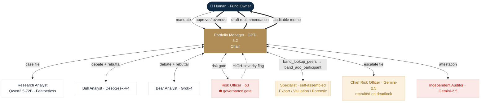
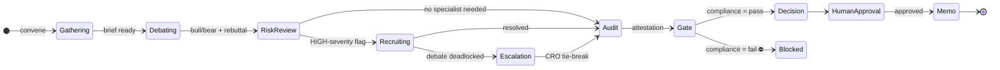

# Quorum — an AI Investment Committee, coordinated by Band

**Quorum replaces the slow, coordination-heavy investment-committee process with a team of specialist AI agents that gather research, debate bull-vs-bear, pass a risk & compliance gate, recruit the right expert for the risk at hand, escalate deadlocks, and submit the decision for an independent audit — all coordinated agent-to-agent through [Band](https://band.ai), with a human approving the final call.**

> Built solo for the lablab.ai **Band of Agents Hackathon** (June 2026) · **Track 3: Regulated & High-Stakes Workflows**.
> *Illustrative demo — not investment advice. Quorum pulls live fundamentals from Yahoo Finance at run time (cached for resilience); this replay shows committed snapshots from committee runs on 15–16 June 2026.*

| | |
|---|---|
| ▶ **Interactive demo** | **[quorum-ai.streamlit.app](https://quorum-ai.streamlit.app/)** *(replay terminal — no keys, can't drain credits)* |
| 🎬 **Demo video** | `<VIDEO_URL>` |
| 📊 **Pitch deck** | **[Quorum-Deck.pdf](docs/Quorum-Deck.pdf)** |

---

## The 60-second version

An investment committee at an asset manager runs a manual loop: analysts compile data, a bull and a bear argue, risk & compliance weighs in, a PM decides, and someone writes the paper trail. It's **slow, inconsistent, and hard to audit** — and under the EU AI Act and SEC/FINRA recordkeeping rules, that audit trail is **legally required**.

Quorum runs that entire loop as a **governed multi-agent committee on Band**. The committee isn't a fixed pipeline — it **rewrites its own membership** based on what its risk officer finds, **escalates** when the debate deadlocks, and **audits itself** before a human signs off. Every handoff is a real agent-to-agent message routed through Band.

Three real runs ship with the demo:

| Run | Risk that fired | Specialist self-recruited | Escalation | Audit | Decision |
|---|---|---|---|---|---|
| **NVDA** | Export-control exposure | Export Controls Analyst | — | ✅ pass | **BUY** · 8% |
| **EA** | Earnings-quality / revenue recognition | Forensic Accounting Analyst | CRO tie-break | ✅ pass | **BUY** · 6% |
| **AAPL** | Premium valuation (≈30× fwd P/E) | Valuation Specialist | CRO tie-break | ✅ pass | **HOLD** |

---

## Application of Technology — Band *is* the coordination layer

Band is the **only** channel the agents share. There is no orchestration bus, no shared database, no direct function calls between agents — visibility is **mention-scoped**, so the evolving case file physically travels inside Band messages and the Portfolio Manager routes the meeting with `@mentions`. Five Band capabilities do real work:

- **Mention-routed handoffs & shared context** — Research → Bull ∥ Bear → Risk → Specialist → CRO → Auditor → Human, each a Band message carrying the case file forward.
- **Role specialization** — ten registered agents, each with a distinct mandate and its own model.
- **Live peer discovery & recruitment** — the PM calls `band_lookup_peers` then `band_add_participant` to pull a specialist (or the CRO) *into the room mid-meeting*, only when the risk findings call for it.
- **Governance gate** — the PM cannot finalize while the Risk Officer's compliance status is failing. The gate is enforced in the protocol, not assumed.
- **Human-in-the-loop** — the final decision pauses at a human approval step inside Band before it becomes a memo.

### The committee (ten agents · five model vendors · one Band room)

| Seat | Role | Model | Vendor (via) |
|---|---|---|---|
| **Portfolio Manager** (Chair) | Orchestrates the meeting, weighs debate + risk, makes the call | GPT-5.2 | OpenAI · AI/ML API |
| **Research Analyst** | Builds the neutral case file from live Yahoo Finance data | Qwen2.5-72B | **Featherless** (open weights) |
| **Bull Analyst** | Strongest case *to invest*; must rebut the bear | DeepSeek-V4 | DeepSeek · AI/ML API |
| **Bear Analyst** | Strongest case *against*; must rebut the bull | Grok-4 | xAI · AI/ML API |
| **Risk Officer** | Compliance gate + position limits; flags risk severity | o3 | OpenAI · AI/ML API |
| **Chief Risk Officer** | Tie-breaks a deadlocked debate (recruited on demand) | Gemini-2.5 Pro | Google · AI/ML API |
| **Export Controls Analyst** | Specialist — recruited for export/geopolitical risk | Grok-4 | xAI · AI/ML API |
| **Valuation Specialist** | Specialist — recruited for multiple/valuation risk | DeepSeek-V4 | DeepSeek · AI/ML API |
| **Forensic Accounting Analyst** | Specialist — recruited for earnings-quality risk | Gemini-2.5 Pro | Google · AI/ML API |
| **Independent Auditor** | Standing control — attests pass / qualified / fail on the decision trail | Gemini-2.5 Pro | Google · AI/ML API |

**Partner-prize architecture (a real cost story, not box-ticking):** **AI/ML API** is the single gateway to four frontier vendors (OpenAI, DeepSeek, xAI, Google) for the judgment-heavy seats; **Featherless** runs the open-weight Qwen model for the high-volume research extraction. Frontier models for judgment, open models for bulk — routed through one Band committee.

### Architecture



*Every arrow is a mention-routed Band message. Dashed = conditional; double = the human governance loop.*

The committee uses three Band platform tools to do all of this: **`band_send_message`** (every handoff), **`band_lookup_peers`** (discover a specialist), and **`band_add_participant`** (pull them into the live room).

### Meeting lifecycle (task state)

The PM drives the meeting through an explicit nine-step protocol (`prompts.py`). The state advances only on real Band events, and two states are **hard gates** — the meeting physically cannot reach a memo until they clear:



### Verify it yourself — Band is doing the work, not wrapping it

The transcripts in `transcripts/*.json` are **unedited Band room exports**. Open any one and you can read the coordination directly. For example, when the Risk Officer flags export-control risk, the PM discovers and recruits the Export Controls Analyst, and **the case file travels *inside* the Band message** (there is no shared database — mention-scoped visibility means context must move through Band):

```text
Portfolio Manager → @[[2fb711b7-…]]            ← Band mention-routing

   CASE FILE — NVDA (Export Controls Focus)
   - Revenue: $253.5bn | YoY growth: 85.2% | Forward P/E: 16.7x
   - High-severity risk flag (from Risk Officer): "Expanded export controls…"

Export Controls Analyst → @[[f3c06f59-…]] @Portfolio Manager
   {"domain": "export controls", "assessment": "Further tightening on
    advanced AI GPUs to China likely, with material datacenter exposure…"}
```

**Why this is not a thin Band wrapper, notifier, or output channel:**

- **Mention-scoped visibility forces real coordination.** Agents see *only* messages they're `@mentioned` in. Context cannot sit in a global variable — the PM must actively route the evolving case file through Band on every handoff. Remove Band and the agents are blind to each other.
- **The participant set changes at runtime.** `band_add_participant` pulls a specialist (or the CRO) into the live room based on the risk findings — membership is decided by Band peer discovery *mid-meeting*, not pre-wired.
- **Band carries control flow, not just output.** The governance gate and the human approval are routing decisions *inside* the Band conversation; the meeting cannot advance to a memo until the compliance and human states allow it.
- **It is the only channel.** No message bus, no shared store, no direct inter-agent calls — every one of the 18–20 turns per meeting is a Band message you can read in the export.

### Where to see each capability (rubric → evidence)

| Band capability | What to look for | Where |
|---|---|---|
| Mention-routed handoffs | `@[[uuid]]` addressing on every turn | any `transcripts/*.json`; shown as "→ recipient" in the app |
| Shared context, no shared DB | full case file embedded in the PM's routing message | the excerpt above |
| Role specialization | 10 distinct prompts + 10 model assignments | `prompts.py` → `ROLES` |
| Live peer discovery + recruitment | `band_lookup_peers` then `band_add_participant` | `prompts.py` steps 5 & 7; specialist appears mid-transcript |
| Task state / lifecycle | the 9-step meeting protocol | `prompts.py` PM protocol; state diagram above |
| Enforced governance gate | "may NOT finalize while compliance = fail" | `prompts.py` step 6 |
| Human-in-the-loop | approval pause before the memo | `prompts.py` step 8; the `approve` turn in each transcript |
| Reliability under failure | retries empty turns so a meeting never silently stalls | `reliable_adapter.py` |

---

## Business Value

Investment committees and equity-research desks run the review-and-decide loop by hand. It is slow (analyst-days of prep per name), inconsistent (anchoring, politics, who's in the room), and expensive to document. Quorum makes it **fast, consistent, and traceable by construction**:

| | Manual committee | Quorum |
|---|---|---|
| Prep + debate cycle | 2–4 analyst-days per name | minutes |
| Consistency | anchoring-prone, varies by room | adversarial debate + enforced gate |
| Audit trail | written by hand | auto-generated + independently attested |
| Reproduce a past decision | difficult | full Band trail, replayable |

**Why now — regulation creates the market for decision provenance.** Under the **EU AI Act** (traceability for high-risk AI) and **SEC/FINRA recordkeeping** (e.g. SEC Rule 17a-4), the decision audit trail is a *legally required* artifact. Quorum emits it automatically — turning compliance documentation from a manual chore into a byproduct.

**Market (cited, conservative anchors).** Quorum sells into the **investment-management software** market — ≈$4.9B in 2025 growing ≈11–12% to ≈$8.5B by 2030 — expanded by the **AI-in-asset-management** (≈$3.8B, ≈24% CAGR) and **RegTech** (≈$16B+, ≈20% CAGR) markets that map to its decision-quality and compliance value props. Serviceable base: **16,544 SEC-registered RIA firms managing $176.8T (2025)**, plus hedge funds, pensions, endowments, and family offices.

**Revenue model:** seat SaaS + per-decision usage + a premium **compliance tier** (the retained audit trail) — the stickiest layer, because it maps to a regulatory obligation rather than a preference.

→ Full sizing, bottom-up SOM, competitive analysis, and sources: **[`docs/business-case.md`](docs/business-case.md)**.

---

## Originality — beyond a linear pipeline

Three behaviors take this past a chatbot or a fixed automation, each visible in the demo:

1. **A self-assembling committee.** The roster is not hardcoded. The Risk Officer's findings *determine who joins*: a HIGH-severity flag triggers the PM to discover and recruit the one specialist whose domain matches the most decision-relevant risk. Same fund, three companies, three different committees.
2. **Adversarial review with escalation.** Bull and Bear must rebut each other's strongest point; a deadlock escalates to a Chief Risk Officer tie-break rather than the PM quietly picking a side.
3. **An independent audit gate.** A standing Independent Auditor reviews the decision trail and attests *pass / qualified / fail* before the human ever sees the draft.

**Honest prior-art note:** open-source bull/bear "trading committees" (e.g. *TradingAgents*) exist. Quorum's differentiation is the **governance layer on top** — risk-driven *self-rewiring* of the roster, an enforceable compliance gate, an independent audit attestation, and human sign-off — i.e. the *regulated-workflow* story, coordinated through Band, not just a debate.

---

## Presentation — how to read the demo

The demo is a read-only **replay terminal**: pick a company and watch the committee deliberate turn by turn. Each card shows **who spoke, on which model, to whom**, and the structured payload they handed off. Look for the four moments: the **handoff**, the **self-assembly** (a specialist appears mid-meeting), the **governance gate / escalation**, and the **independent audit badge** before human approval.

The replay reads **committed transcripts that are genuine Band exports** (`transcripts/*.json`) — it makes **zero API calls and needs no keys**, so it can't burn credits or fail live during judging.

---

## Run it yourself

**Just explore the demo** (no keys, no risk):
```powershell
uv sync
uv run streamlit run app.py
```
Pick NVDA / EA / AAPL and step through the committee.

**Reproduce a live committee on Band** (your own keys):
```powershell
copy .env.example .env                            # add your AI/ML API + Featherless keys
copy agent_config.example.yaml agent_config.yaml  # then fill in each agent's id + key
uv run python run_all.py                          # launches all 10 agents in one process
```
Register the 10 agents at [app.band.ai/agents](https://app.band.ai/agents) → *New Agent → External Agent*, using the **exact display names** listed in [`agent_config.example.yaml`](agent_config.example.yaml); copy each agent's UUID and API key into your `agent_config.yaml`.
Then in a Band room, add the standing roster and send:
`@Portfolio Manager convene the committee to evaluate NVDA for the Northwind Tech Growth Fund.`
The PM recruits the specialist / CRO / auditor from there. Approve with `@Portfolio Manager approve`.

---

## The demo scenario

**Northwind Tech Growth Fund** — long-only, GARP, 5–10% target position, **max 10% single name / 35% sub-industry**, valuation flag above ≈40× forward P/E. Tickers chosen to exercise different paths: **NVDA** (export-control risk), **EA** (earnings-quality risk + deadlock), **AAPL** (valuation risk + deadlock).

## Repo layout

| File | Purpose |
|---|---|
| `prompts.py` | All ten role prompts + the PM's meeting protocol; the `ROLES` model fleet |
| `committee.py` | Per-agent entrypoint + adapter wiring |
| `reliable_adapter.py` | `ReliableLangGraphAdapter` — retries empty turns so a meeting never silently stalls |
| `company_data.py` | The `get_company_data` tool — live Yahoo Finance fundamentals, cached to `data/` as a fallback |
| `data/*.json`, `data/risks/*.json` | Cached financial snapshots + the curated risk dossier that drives self-assembly |
| `run_all.py` / `start_all.ps1` | Launch all agents (one process / one window each) |
| `app.py` | Streamlit replay terminal |
| `replay_data.py` | Parses Band room exports into the render model |
| `transcripts/*.json` | The three real committee runs |
| `docs/business-case.md` | Market sizing, revenue model, competitive analysis (deck source) |

## Tech stack

Python · [Band SDK 1.0](https://band.ai) (LangGraph adapter) · AI/ML API (OpenAI, DeepSeek, xAI, Google) · Featherless (open-weight Qwen) · Streamlit. Secrets live in `.env` / `agent_config.yaml` and are git-ignored.

---

*Quorum is an illustrative demonstration of a multi-agent governance workflow. It pulls live fundamentals from Yahoo Finance at run time (cached for resilience); this replay shows committed snapshots from committee runs on 15–16 June 2026. It is not investment advice and produces no real orders.*
